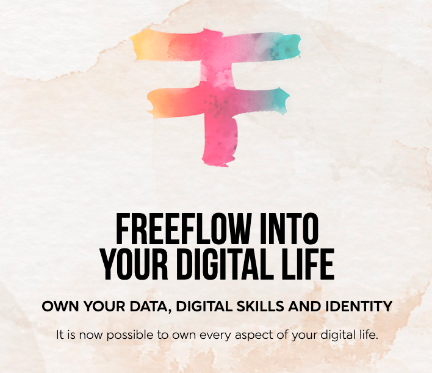
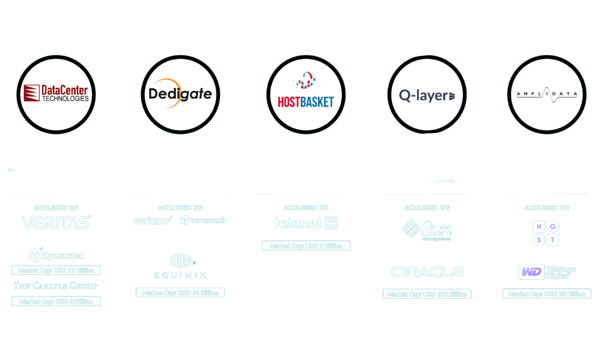

<!-- section 1 -->

 

# About
 
### What & Who We Are.

 

A venture creator is a company or organization that creates and develops new businesses, typically in the form of startups. Support includes providing funding, resources, and mentorship.



<!-- section 2 -->



The OurWorld Venture Creator is backed by the ThreeFold Team – with the goal of not just doing business, but doing good for the world while we’re at it. We are an international team of experts and passionate believers in a better world who choose to act to make a difference.

 

This journey began with the creation of a new Internet infrastructure layer, a process that took over 20 years – and was made possible by the contributions of thousands of people. Thank you to everyone who has made this possible.

 

Our co-founders also have experience running [Incubaid](https://incubaid.com), a successful incubator focused primarily on helping to change our planet for the better through technology that supports decentralization. Over 19 years, Incubaid did seven strong exits.

|||



<!-- section 3 -->



|||

ThreeFold Tech has successfully created cutting-edge technology for an upgraded Internet and digital twin technology with an embedded ultra scaleable financial system.

 

The ThreeFold Grid, which deploys this technology in an open-source model, has been active for years and is also in its third generation. The community continues to add capacity and use it on a daily basis, as seen on the ThreeFold Grid explorer statistics.

 

We have signed an agreement with the government of Zanzibar for the implementation of a digital free zone utilizing our technology.



<!-- section 4 -->



We have also completed all necessary preparations for the launch of our digital twin, the freeflow twin, which can be viewed on the website [freeflow.life](https://freeflow.life). This venture is ready to launch and is eagerly anticipated by the community.

 

There are multiple ventures waiting to be born as more funding comes in to use our technology and provide value for large communities.

|||



<!-- section 5 -->

 

## We Are an Experienced Team

### With Seven Exits Over Two Decades

