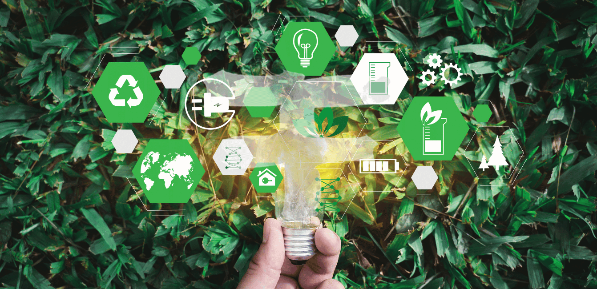
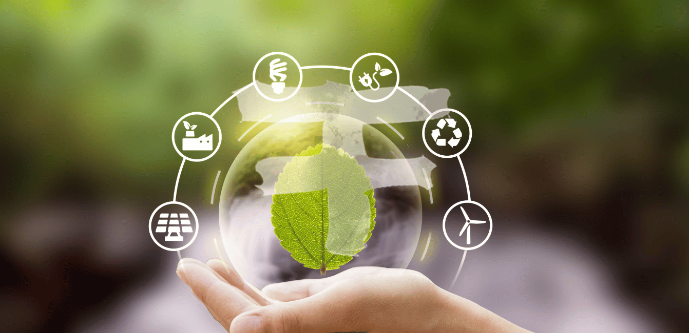
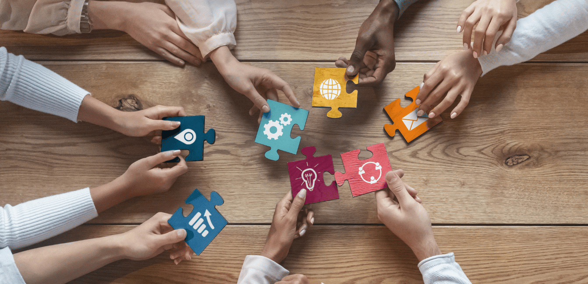
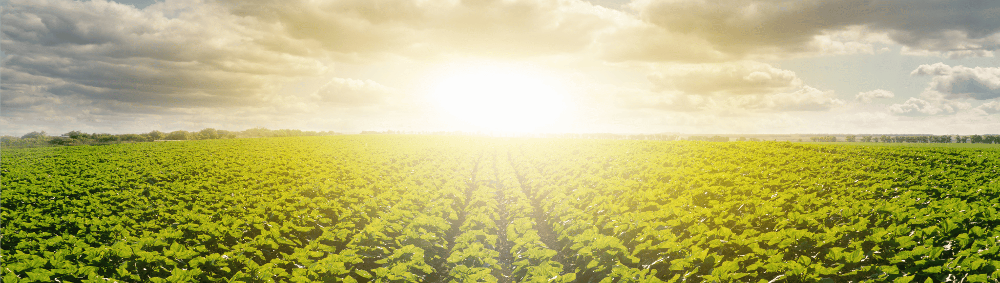

<!-- section 1 (header) -->



### GROWTH BEGINS

#### IN CREATOR ZONES

 

Creator Zones are set up to allow aspiring entrepreneurs, business people and digital nomads to work together on projects and experiences that bring a positive impact to the society.

<button>[EXPLORE]("/")</button>

|||



{{ space() }}



|||

## LOVE OF NATURE

 

Creator Zones are always integrated with nature.
This creates a more sustainable environment that
allows community members to be more
sustainable. This also promotes greener habits
to become the standard of every Creator Zone.



{{ space() }}



|||

## BUILT BY

### TOGETHERNESS

 

Co-living and coworking in Creator Zones allow members to create effective and innovative experiences.

 

We have created an environment where collaboration and team work lead to the developoment of advanced technologies that focus on endless creating opportunities.


{{ space() }}



 

 

### REGENERATIVE

## FARMING

 

We work with the local population to allow them to help and earn from the Creator Zone community by assisting in regenerative farming. This makes our communities promote healthier living and also allows us to become more self-sufficient.



{{ space() }}



### THE POWER

## OF P2P

 

All Creator Zone experiences and technologies are built on top of the world’s largest decentralized and peer-to-peer network, the ThreeFold Grid. This allows endless security and scalability for all projects whilst offering limitless opportunities.

<button>[LEARN MORE]("/")</button>

|||



{{ space() }}



## WANNA GET **INVOLVED?**

 

Interested in partnering up? Or just wanna say hi?

Drop us a message!

<button>[Email](mailto:info@ourverse.tf)</button>

 

OUR**WORLD**


