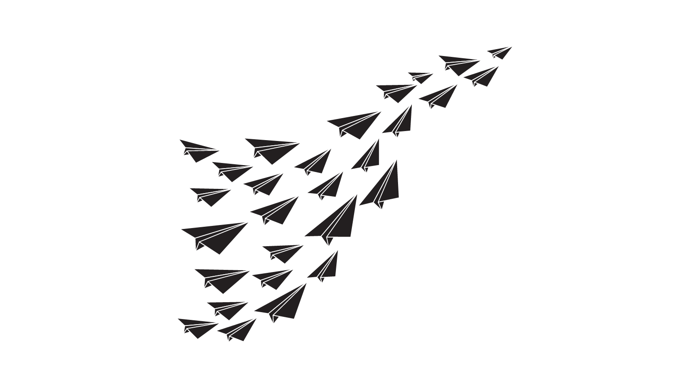

<!-- section 1 -->

 

## OurWorld
 
### A Platform to Enable Self-Sovereignty.

Together we are creating a multi-faceted platform to support and empower startups aspiring to harness the potential of emerging technology while putting the planet and people first. The sun is rising on a new way forward.

<button>[Our Ventures](/ventures)</button>



<!-- section 2  -->



## What We Provide



<!-- section 2  -->



### Funding Platform

 

Funding for potentially hundreds of like-minded projects, with a primary focus on emering technology that puts the planet and people first.

|||

### Technological Platform

 

A technological platform that enables everyone to be self-sovereign from a digital perspective.

|||

### Legal & Financial Independence Platform

 

Supplement technological sovereignty with a system that offers legal and financial independence through mechanisms like free zones and sovereign sustainable charter cities.

|||

### Life Supporting Platform

 

Create a sovereign and efficient set of platforms for financial, educational, and health systems, which can be utilized by all startups within the venture creator.





## The Foundation of Every Venture



<!-- section 4  -->



### Planet First

 

Never do anything which does not respect mother earth.

|||

### People First

 

Equality for everyone.

|||

### Open Source

 

For all sectors from healthcare to software to legal to education.

|||

### Authenticity

 

Restore authenticity of people and information.

|||

### Simplicity

 

Complexity is killing progress.





## Our Journey



<!-- section 3  -->



### Phase One

#### Creation of Core Tech

 

10+ years of development.

 

Built decentralized, autonomous, edge Internet technology.

 

50M USD invested by community and TF Tech investors.

|||

### Phase Two

#### Expansion & Proof

 

Signed with government of Zanzibar for digital free zone and connected charter city.

 

Eight projects with working tech, active and ready to scale.

 

Core technology proven.

|||

### Phase Three

#### Launch Our Ventures

 

Conclude on 30M USD fundraise.

 

Global awareness campaign.

 

Launch digital asset exchange, carbon credits.

 

Millions of people using services and products of our ventures.

|||

### Phase Four

#### Sovereignty For All

 

+1 million nodes deployed.

 

Impacting +100 million people.

 

The startups in the venture creator are now community-owned and our investors received a good exit.

