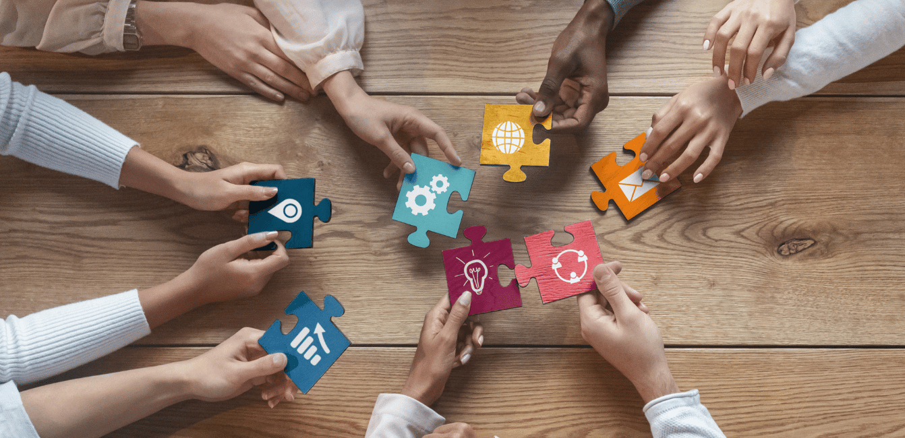
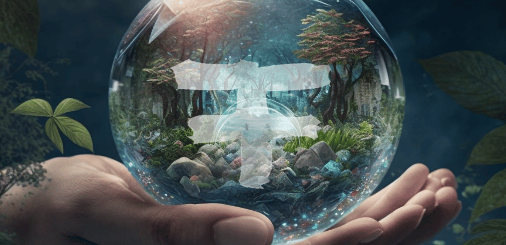

<!-- section 1 (header) -->

 

 



### THIS IS HOW THE WORLD TRANSFORMS

 

Explore the four layers of a decentalized and peer-to-peer future where no one is left behind.

<button>[EXPLORE]("https://threefold.io")</button>





### LAYER ONE

## THE GRID

 

Creator Zones are dedicated to building super-sustainable coworking and co-living communities where entrepreneurs, digital nomads and residents collaborate to build beautiful experiences that positively impact the lives of millions.

<button>[KNOW MORE]("https://library.threefold.me/info/threefold#/tfgrid/threefold__grid_home")</button>

|||



{{ space() }}



|||

### LAYER TWO

## EXPERIENCES

 

Creator Zones are dedicated to building super-sustainable coworking and co-living communities where entrepreneurs, digital nomads and residents collaborate to build beautiful experiences that positively impact the lives of millions.

<button>[KNOW MORE](/creator-zones)</button>



{{ space() }}



### LAYER THREE

## DEFI

 

OurWorld consists of a decentralized internet network as the foundation. This base enables life-changing experiences and capabilties to be openly and freely available to everyone.

<button>[KNOW MORE]("/platform")</button>

|||



{{ space() }}



|||

### LAYER FOUR

## DIGITAL TWIN

 

OurWorld exists to speed up the transition towards inclusivity. We create thriving experiences and ecosystems which enable every human being to learn, partake and succeed.

<button>[EXPERIENCES](/experiences)</button>



{{ space() }}



## WANNA GET **INVOLVED?**

 

Interested in partnering up? Or just wanna say hi?

Drop us a message!

<a class="text-white" href="mailto:info@ourverse.tf" target="_blanck"><button >Email</button></a>

 

#### OUR**WORLD**


